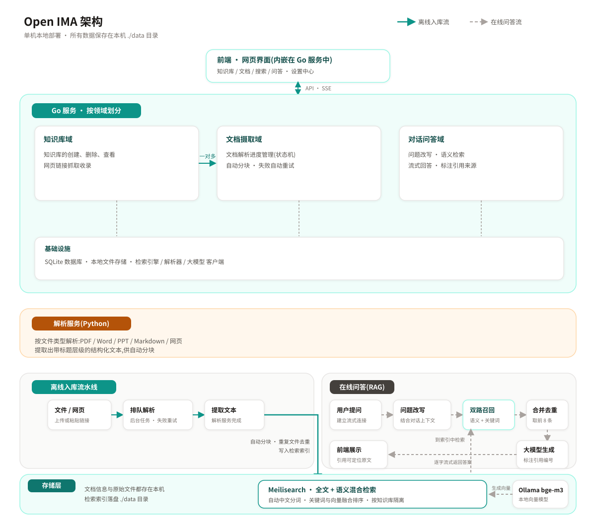

<div align="center">
  
  <h1>Open IMA</h1>
  <p><strong>本地优先的个人知识工作台</strong></p>
  <p>上传文档、收录网页，异步解析入库，再用带引用的流式 RAG 问答你的全部知识。</p>
</div>

## 它是什么

Open IMA 是腾讯 ima 知识库的**本地部署版**：你的文件、网页和对话数据全部落在自己的机器上，检索与问答引擎完全本地运行，只有生成答案的 LLM 走你配置的 API。参考了 ima 后端的架构实践（[知识库后端系统架构](https://cloud.tencent.com/developer/article/2608466)、[Elasticsearch 检索实践](https://developer.cloud.tencent.com/article/2747411)），把千万级租户的设计映射到单机部署。

**核心能力**

- 📚 **多知识库管理** — 创建、删除、浏览，知识库之间检索隔离
- 📄 **多源入库** — 本地文件（PDF / DOCX / PPTX / Markdown / TXT / HTML）+ 网页链接收录
- ⚙️ **异步解析流水线** — 解析 → 分块 → 向量化 → 索引，任务队列驱动，失败自动重试
- 🔍 **混合检索** — BM25 全文 + 向量 KNN + RRF 融合，内置中文分词，带高亮
- 💬 **RAG 智能问答** — 基于单个知识库的对话式问答，SSE 流式输出，答案带可点击定位的引用来源

## 架构

四个进程，一条流水线，数据全部落在本地 `./data` 卷。实线为入库流水线，灰色虚线为问答召回路径：



写入时沿各层自上而下流动；问答时从 Meilisearch 召回后交给云端 LLM（OpenAI / Anthropic 兼容 API）生成。配置支持三层覆盖：yaml → `IMA_` 环境变量 → 运行时持久化设置（前端配置中心可热切换模型与 embedder）。

| 组件 | 技术 | 职责 |
| --- | --- | --- |
| `app` | Go 1.26 · `net/http` · SQLite | REST API + SSE、用例编排、异步 worker、对账任务，内嵌前端 |
| `parser` | Python 3.11 · FastAPI | 媒体解析 sidecar，注册表按类型路由，不下载模型权重 |
| `meilisearch` | Meilisearch v1.10.3 | 全文 BM25 + 向量 KNN + RRF 融合检索，内置 jieba 中文分词 |
| 前端 | React 18 · TypeScript · Vite · Tailwind | 知识库、文档、搜索、对话工作区与配置中心 |
| embedding | Ollama `bge-m3` | 本地向量化，兼容 `/api/embeddings` 端点 |

技术选型与分层细节见 [V1 设计文档](docs/design/2026-09-26-open-ima-v1-design.md)。

## 快速开始

> [!NOTE]
> 支持 macOS 与 Linux。需要本机有 curl 与 bash；其余依赖脚本会自动检查，装了 Homebrew 的 macOS 会自动补齐缺失的工具链。

```bash
git clone https://github.com/toddwyl/open-ima.git
cd open-ima
./scripts/install.sh   # 一键安装全部依赖并生成 .env（随机 Meilisearch 密钥）
./scripts/start.sh     # 一键拉起 Meilisearch + Ollama + parser + app
```

打开 <http://localhost:8080> 即可使用。`install.sh` 完成的事：

| 步骤 | 内容 |
| --- | --- |
| 工具链 | 检查 Go 1.26+ / Node.js 20+ / Python 3.11+ / Ollama，macOS 有 Homebrew 时自动安装缺失项 |
| Meilisearch | 按系统与架构下载 v1.10.3 到 `.local/bin/` |
| parser | 创建 `parser/.venv` 并安装 Python 依赖 |
| 前端 | `npm --prefix web ci` |
| embedding | 自动拉起 Ollama 并 `ollama pull bge-m3` |
| 配置 | 生成 `.env`，随机写入 Meilisearch 密钥 |

**LLM 与 AnySearch 密钥不需要写进 `.env`**：首次提问时按提示打开左下角「配置中心」，粘贴聊天模型 API Key 即可（密钥只保存在本地 SQLite）；需要 Agent 联网搜索时，在同一面板粘贴 AnySearch Key。

## 本地开发

一键启动全栈（Meilisearch + Ollama + parser + app，自动加载 `.env`，Ctrl+C 全部停止，已在运行的依赖会被复用）：

```bash
./scripts/start.sh
```

手动分步启动：

```bash
# 1. parser sidecar
python3 -m venv parser/.venv
parser/.venv/bin/pip install -r parser/requirements-dev.txt

# 2. 前端
npm --prefix web ci
npm --prefix web run dev

# 3. 依赖与后端
brew install ollama && brew services start ollama
ollama pull bge-m3
./scripts/dev-up.sh
go run ./cmd/open-ima
```

## 配置

应用配置全部通过 `IMA_` 环境变量注入，完整示例见 [.env.example](.env.example)：

| 变量 | 说明 |
| --- | --- |
| `IMA_PORT` | 服务端口，默认 `8080` |
| `IMA_LLM_PROTOCOL` | `openai` 或 `anthropic` |
| `IMA_LLM_BASE_URL` / `IMA_LLM_API_KEY` / `IMA_LLM_MODEL` | 聊天模型接入 |
| `IMA_MEILI_EMBEDDER_URL` | embedding 端点（Meilisearch 1.10.3 需要 Ollama 的 `/api/embeddings`） |
| `IMA_MEILI_EMBEDDER_MODEL` / `IMA_MEILI_EMBEDDER_DIMENSIONS` | embedding 模型与维度（`bge-m3` / `1024`） |
| `IMA_MEILI_API_KEY` | Meilisearch master key |

Kimi Coding 两种协议示例：

```bash
# OpenAI Chat Completions
IMA_LLM_PROTOCOL=openai
IMA_LLM_BASE_URL=https://api.kimi.com/coding/v1

# Anthropic Messages
IMA_LLM_PROTOCOL=anthropic
IMA_LLM_BASE_URL=https://api.kimi.com/coding/

IMA_LLM_MODEL=kimi-for-coding
```

可用同一把本地 key 显式验证两种协议（默认跳过，不会在常规门禁中调用外部模型）：

```bash
KIMI_TEST_API_KEY="$IMA_LLM_API_KEY" go test ./internal/infrastructure/llm -run TestKimiCompatibleProtocols -v
```

## 联网搜索（Agent 模式）

Agent 问答模式可调用联网搜索工具，与知识库检索结合作答。搜索由 **AnySearch** 结构化 API 提供（`https://api.anysearch.com/v1/search`），这是本项能力唯一的外部依赖：

1. 在 [anysearch.com](https://www.anysearch.com) 控制台免费创建 API Key；
2. 打开配置中心「联网搜索」，勾选启用并粘贴 Key（密钥只保存在本地 SQLite，读取接口只返回「已配置」标记）。

实测结论：DuckDuckGo 匿名入口对部分出口 IP 长期限流，百度/搜狗等国内引擎对无 cookie 的程序化请求弹验证码，Bing 匿名输出已降级——免密钥抓页没有稳定解，因此不提供免配置提供方；细节见 [常见陷阱](docs/guide/common-pitfalls.md)。

## 验证

```bash
# lint + typecheck + test + build 全量门禁
./scripts/harness.sh

# 默认直接启动本地进程和确定性 mock，完成 HTTP 端到端断言
./scripts/smoke.sh
```

推荐把本机 Meilisearch 放到项目内的忽略目录，脚本会自动使用：

```bash
mkdir -p .local/bin
curl -L --fail -o .local/bin/meilisearch \
  https://github.com/meilisearch/meilisearch/releases/download/v1.10.3/meilisearch-macos-apple-silicon
chmod +x .local/bin/meilisearch
./scripts/smoke.sh

# 也可显式指定其他本机 Meilisearch 二进制
SMOKE_MEILI_BIN=/path/to/meilisearch ./scripts/smoke.sh
```

Business E2E 使用真实 Meilisearch 和本地 Ollama embedding，覆盖知识库、文件与 URL 入库、失败重试、文本/混合检索、对话历史、删除清理、错误状态和内嵌 SPA。

## 重建索引

embedding 模型、维度或索引设置变化后，可重新投递所有有效文档：

```bash
./scripts/reindex.sh
```

该命令会把文档重置为待处理状态并加入解析队列，随后由正常 worker 流水线重新解析、分块、向量化和索引。

## 项目结构

```text
cmd/open-ima/             Go 服务入口
cmd/reindex/              全量重建索引工具
internal/domain/          领域实体、仓储契约与领域服务
internal/application/     跨领域用例与外部能力端口
internal/infrastructure/  DB / 队列 / 检索 / 解析 / LLM 等技术实现
internal/interfaces/      HTTP 入站适配（路由与编解码）
internal/app/             依赖装配根
parser/                   Python 解析 sidecar
web/                      React SPA 与 Go embed
scripts/                  harness、smoke、install、start 等脚本
docs/design/              V1 设计文档
```

开发契约（worktree 工作流、提交策略、验证门禁）见 [AGENTS.md](AGENTS.md)。
