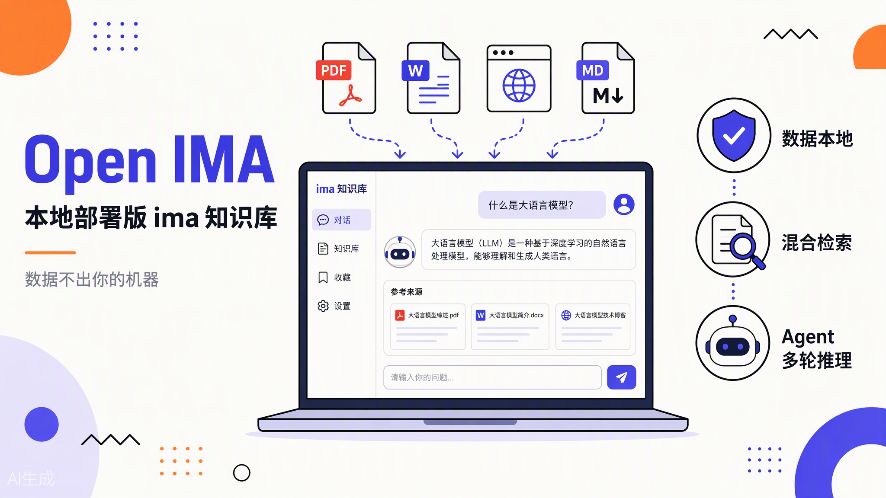
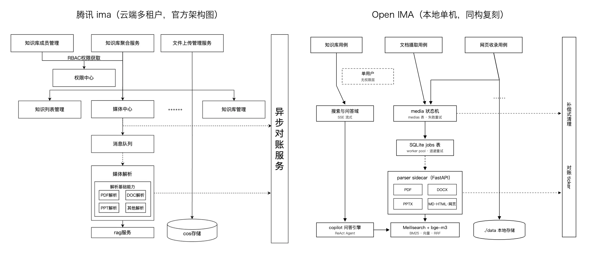
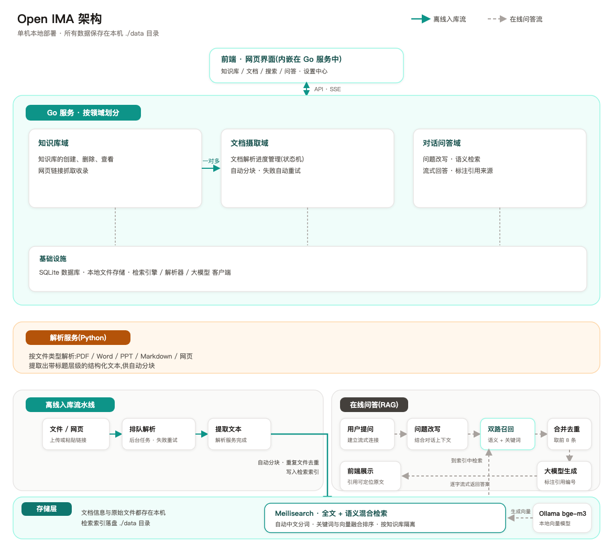

# 腾讯官方公布了 ima 的架构文章，我照着它手搓了一个本地版 ima.copilot

---

先放结果。Open IMA 现在长这样。上传 PDF、Word、网页链接，后台异步解析入库，然后对着自己的知识库提问，流式输出，答案带能点击定位的引用，Agent 模式还会自己决定这一轮搜知识库还是联网搜。



说清楚这是什么。它是腾讯 ima 的开源本地部署复刻版，文件、网页和对话数据全部落在自己机器上，检索和问答都在本地跑，只有最后生成答案那一步走你自己配的 LLM API。做法也直接，腾讯官方公布过两篇 ima 后端架构文章，我把它们当规格书，照着把千万级租户的架构一层一层映射到了单机。

## 为什么要复刻一个 ima

ima.copilot 我自己在用，知识库、问答、联网搜索、智能笔记都有，完成度很高。两个问题绕不开。

一是数据在云端。合同、财报、没公开的研究笔记，很多人不愿意传到第三方云，有些场景是不允许。二是黑盒。检索怎么召回的，引用怎么对上的，模型什么时候决定联网，看不到，也改不动。

巧的是腾讯技术团队自己把答案公布了大半。一篇《腾讯 AI 智能工作台 IMA 的知识库后端系统从 0 到 1 架构实践》，一篇《腾讯 ima AI 知识库 Elasticsearch 检索实践》，数据模型、分层架构、检索方案都讲得相当坦诚。官方文章当规格书，这事就可做了。

## 它和 ima.copilot 的区别

先把差异摆清楚，免得误会。

| 维度 | ima.copilot（腾讯官方） | Open IMA |
| --- | --- | --- |
| 部署 | 云端 SaaS，App、小程序、PC | 单机本地部署 |
| 数据归属 | 腾讯云端 | 本地 ./data 目录加 SQLite |
| 用户体系 | 多租户，微信生态登录 | 单用户，没有账号系统 |
| 外部依赖 | 全托管 | 只有 LLM 生成走自配 API，OpenAI 或 Anthropic 兼容都行 |
| 智能笔记、OCR、音视频 | 有 | 明确不做，留给 V2 以后 |
| 源码 | 闭源 | 开源，架构分层可读可改 |

说得简单一点。ima 是产品，Open IMA 是把 ima 公开架构落到本地的工程实现。功能上是子集，架构思想同源。

## 实现有多像

这是这个项目最有意思的部分。腾讯文章里每一层生产级组件，我都给了一个语义不变、规模降级的本地等价物。

| 腾讯 ima 的做法（千万级租户） | Open IMA 的本地做法 |
| --- | --- |
| Media 和 Chunk 两层数据模型 | medias 和 chunks 两层模型，文件管理与检索单元解耦 |
| 统一接入层，拆成知识库、媒体中心、文件上传三个服务 | Go DDD 分层里 application 层的三个用例域，职责一一对应 |
| 独立解析层，媒体解析加解析基础能力 | Python FastAPI parser sidecar，注册表按类型路由，HTTP 可插拔 |
| COS 对象存储 | 存储接口保持对象存储语义（Put、Get、Delete），V1 实现成本地目录 |
| 消息队列异步削峰 | SQLite 任务表加 Go worker pool，状态机加指数退避重试，不引入外部 MQ |
| 原子聚合服务加异步对账 | 删除走补偿式清理，Meili、文件、DB 依次清，media 状态机驱动失败重试 |
| ES 双路召回加 RRF 加租户路由 | Meilisearch 混合检索自带 RRF，用 kb_biz_id 过滤做库级隔离 |
| Query 改写，多 query 扩展 | LLM 生成一条扩展 query，和原 query 合并召回 |

下面这张图把两边并排画了出来，左边是腾讯官方文章里的架构图，右边是我按同一骨架画的本地图，可以对着表看。



四个进程，一条流水线。app 是 Go 写的，管 REST API、SSE 和异步 worker，前端直接嵌在二进制里。parser 是 Python 解析 sidecar。meilisearch 管检索，BM25、向量 KNN、RRF 融合都在它里面，中文分词用内置的 jieba。embedding 由本地 Ollama 跑 bge-m3。除了生成答案的 LLM，没有任何字节离开这台机器。



## 技术框架和实现细节

图纸讲完，落地选型有几个决定值得说。

- **后端 Go 1.26，原生 net/http，不上重型框架。** SQLite 用 modernc.org/sqlite 纯 Go 驱动，零 CGO。整个后端编译成一个静态二进制，前端构建产物也嵌进去，交付就是一个文件。
- **DDD 五层。** domain 放实体和仓储契约，application 放用例和外部能力端口，infrastructure 放 DB、队列、检索、解析、LLM 这些技术实现，interfaces/http 管路由编解码，app 是唯一装配根。依赖方向不靠口头约定，architecture_test.go 里有测试钉死，谁敢让 domain 依赖 infrastructure，测试直接红。
- **业务键和自增主键分开。** 所有实体对外只暴露 UUID 业务键，自增 id 只留在 DB 层。Schema 带版本号，v2 升 v3 走 ALTER 在线升级，版本不符就拒绝启动，不静默写坏数据。
- **解析 sidecar 刻意保持轻。** FastAPI 加 pypdf、python-docx、python-pptx、readability，注册表按类型路由，不下载任何模型权重。OCR 和版面分析留了 docling 升级口，V1 不做。
- **检索全部托管给 Meilisearch v1.10.3。** embedding 也交给它管。配好 documentTemplate 以后，Meilisearch 自己把分块渲染成文本，再调本地 Ollama 的 bge-m3 向量化，1024 维。混合检索是一次 API 调用，不用自己维护三条流水线。
- **分块按字符不按 token。** 512 字符切分，80 字符重叠，每个 chunk 带上标题路径，比如“第三章 3.2 节”这种。召回时模型看到的不是孤儿段落。
- **LLM 双协议。** OpenAI Chat Completions 和 Anthropic Messages 都支持，配置中心可以运行时热切换模型和 embedder，不用重启。
- **工程纪律当功能做。** 所有开发在 git worktree 里隔离进行，harness.sh 是全量门禁，gofmt、vet、TS typecheck、前后端测试、构建，不过不能提交。smoke.sh 用确定性 mock 跑 HTTP 端到端，不依赖任何外部服务也能把主流程验证一遍。

## Copilot 的 Agent 引擎是怎么做的

知识库问答之外，ima copilot 的核心是 Agent 模式。模型自己决定搜不搜，搜知识库还是联网，结果不够要不要再补一轮。V1 的固定管线是改写、检索、生成一条道走到黑，模型没有这个决策权，这是和官方产品最大的差距。

腾讯没有公布这部分实现，只能自己把引擎设计出来。最后落地的结构长这样。

- **ReAct 四阶段循环。** Think 带着工具定义调 LLM，Analyze 判定该不该停，Act 并发执行这一轮的工具调用，Observe 把结果塞回上下文，进下一轮。
- **引擎跨 turn 无状态。** 历史每轮从 DB 重建。
- **循环守护。** 最大轮次 20，空回答重试 2 次，连续重复内容判定卡死，连续截断有检测，用户取消时用已有结果兜底合成答案。
- **四个工具。** search_knowledge、read_document、list_documents、web_search。
- **快问和 Agent 只是同一个引擎的两个配置档。** SSE 事件契约统一，前端单一渲染管线，共用一套代码。

实测的时候拿投资知识库提问，Agent 跑 2 到 7 轮不等。有一个需要知识库加联网结合的问题跑了 7 轮，给出一份混合引用的答案，库内分块加网页一共 92 条引用，步骤树实时渲染，落库之后回放逐字一致。

## 真正难的在规格书之外

架构映射表看着顺滑，真写起来，费时间的全是规格书里没有的东西。举三个我真实踩过的坑，都记在仓库的 docs/guide/common-pitfalls.md 里。

**坑一，流式输出里的引用句柄，改写时机错一拍就全错。** Agent 生成的答案内部用 [c2] 这种句柄引用检索分块，展示前要改写成可读引用。第一版只在持久化前改写，SSE 流式 token 里就残留了裸的 [c2]，用户眼睁睁看着它流出来。更阴的是 read_document 工具输出里的 [分块3/12] 这种给人类看的记号，模型会照抄进答案当成引用格式。最后的解法是让每个分块都带 cN 句柄并回填 citations，改写逻辑前移到引擎 emitAnswer，流式出来的和落库的逐字一致。

**坑二，免密钥联网搜索没有稳定解。** DuckDuckGo 匿名入口对部分出口 IP 长期 202 限流，退避重试只能缓解。百度对无 cookie 的程序化请求直接弹图形验证码，得先做 cookie 预热。Bing 匿名输出已经降级。折腾一圈得出结论，免配置提供方不存在，老老实实接一个结构化搜索 API。项目用的 AnySearch，Key 免费，只存本地 SQLite。

**坑三，npm ci 顺着符号链接把主仓库的 node_modules 清空了。** 开发用 git worktree 隔离，我为了省空间把 worktree 里的 node_modules 软链到主检出。npm ci 的语义是先删再装，它删的是链接目标的内容。主仓库依赖瞬间蒸发。类似的还有 go run，后台进程杀掉的只是 wrapper，编译产物继续持有端口，下一次启动健康检查打到残留的旧进程上，整套验证都在跑错的二进制。

这类坑有个共同点。架构文章告诉你组件怎么摆，不告诉你组件接缝处的语义会咬人。复刻的价值一半在图纸，另一半在把这些接缝全部趟一遍。

## 怎么在自己机器上跑起来

前置条件有这些。Go 1.26、Node.js 20+、Python 3.11+、Ollama（先 `ollama pull bge-m3`）、一个 LLM API Key，任何 OpenAI 或 Anthropic 兼容端点都行，我用的 Kimi Coding。Meilisearch 不用单独装，脚本发现项目 `.local/bin` 里有就会直接用。

```bash
git clone https://github.com/toddwyl/open-ima.git
cd open-ima
cp .env.example .env
# 编辑 .env，填 IMA_LLM_API_KEY 等三项

# 把 Meilisearch 放进项目内，脚本会自动识别
mkdir -p .local/bin
curl -L --fail -o .local/bin/meilisearch \
  https://github.com/meilisearch/meilisearch/releases/download/v1.10.3/meilisearch-macos-apple-silicon
chmod +x .local/bin/meilisearch

./scripts/start.sh   # 一键拉起 Meilisearch、parser、app，Ctrl+C 全部停止
```

打开 http://localhost:8080，建知识库，拖文件进去，等解析状态变绿，然后开问。要联网搜索的话，去 AnySearch 控制台免费拿个 Key，在配置中心的联网搜索里粘贴启用。

想验证改动就跑 ./scripts/harness.sh，lint、typecheck、前后端测试、构建全在里面。./scripts/smoke.sh 会拉起确定性 mock 依赖做 HTTP 端到端断言，不依赖外部服务。

## 开源和讨论

完整设计文档、踩坑记录、业务 E2E 用例矩阵都在仓库里。

**👉 github.com/toddwyl/open-ima**。欢迎来看实现细节，提 Issue 讨论。RAG 工程化、Agent 引擎设计，或者把大厂公开架构当规格书复刻这个玩法本身，评论区都可以聊。

> **说明。** 本项目是个人技术研究项目，与腾讯公司无关。ima、ima.copilot 均为腾讯相关产品或项目名称。架构参考自腾讯官方公开发表的技术文章，不涉及任何私有信息。

---

## References

- 腾讯云开发者社区《腾讯 AI 智能工作台 IMA 的知识库后端系统从 0 到 1 架构实践》 https://cloud.tencent.com/developer/article/2608466
- 腾讯云开发者社区《腾讯 ima AI 知识库 Elasticsearch 检索实践》 https://developer.cloud.tencent.com/article/2747411
